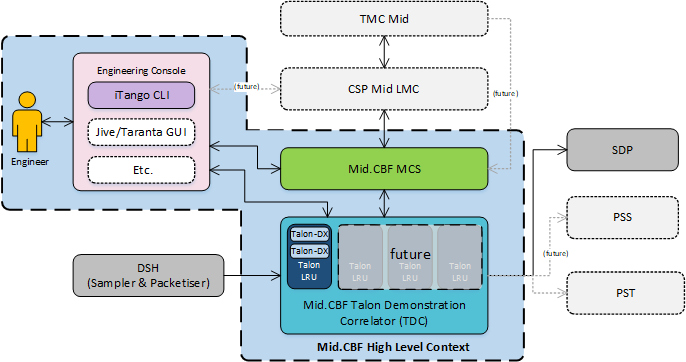
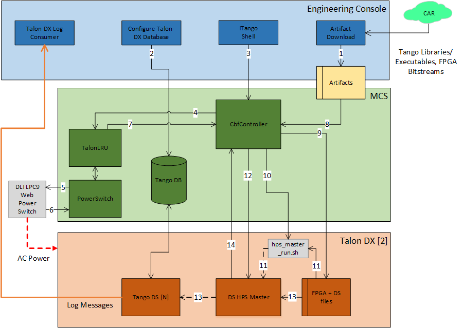

Overview
********
The Mid CBF Engineering Console is intended for integration and testing of the 
`Mid CBF MCS <https://gitlab.com/ska-telescope/ska-mid-cbf-mcs>`_ and the Talon DX 
hardware.

As required, the Engineering Console will:
   - Provide emulation of LMC control of MCS
   - Provide intrusive tools to monitor and control Mid CBF
   - Access to configuration-managed `FPGA bitstreams <https://artefact.skatelescope.org/#browse/browse:raw-internal:ska-mid-cbf-talondx>`_ and `Talon DX binaries <https://artefact.skatelescope.org/#browse/browse:conan-internal:nrc>`_ for deployment to Mid CBF

See `MCS-Talon Integration <https://confluence.skatelescope.org/display/SE/MCS-Talon+Integration>`_
for further details of the integration and test work as it evolves.

Note: MCS does not currently allow its LMC interface to be externally exercised -- i.e., 
it needs to exercised from within the Kubernetes cluster. MCS commands can be issues via an 
iTango3 shell running in the MCS cluster -- see Engineering Console README for details.

System Context
==============
The following diagram shows the Mid.CBF Engineering Console as it fits into the rest of the CSP Mid
system.

    Engineering Console System Context

Interfaces
==========
# TODO

On Command Sequence
===================

The On command sequence shown in the diagram below is used to automatically power on the
Talon-DX boards, copy the appropriate FPGA bitsteam and HPS device server binaries to the Talon-DX
boards and start the device servers on the HPS of each board. The sequence is as follows:

1. Download artefacts (bitstreams and binaries) from the Central Artefact Repository , and build
   the MCS Docker container after downloading. Optional: Override the DS artefacts with local builds.
2. Configure the MCS Tango database to add entries for the HPS device servers and the log consumer.
3. Use the LMC script to send the On command to the ``CbfController``.
4. The ``CbfController`` propagates the On command to the ``TalonLRU`` Tango device, which then
   propagates it to the ``PowerSwitch`` device.
5. The ``PowerSwitch`` device communicates with the power switch hardware over HTTP, requesting
   power on of specific outlets.
6. The power switch hardware switches the requested outlets on and responds to the ``PowerSwitch`` device.
7. The result of the ``TalonLRU`` On command is propagated back to the ``CbfController``.
8. ``CbfController`` reads the JSON configuration file in the artefacts folder to detemine which
   Talon-DX boards it needs to configure.
9. FPGA bitstreams and device server binaries are copied to each Talon-DX board.
10. The ``CbfController`` runs the ``hps_master_run.sh`` script on each Talon-DX board to start the HPS Master.
11. The HPS Master device server is started on each Talon-DX board using the copied binary.
12. The ``configure`` command is send to each HPS Master device server.
13. The HPS Master device server programs the FPGA with the bitstream and starts the 
    remaining HPS devices on each board.
14. HPS Master responds with success/fail result of the ``configure`` command.

For a description of how to run this sequence of steps see the :ref:`Configure the Talon-DX Boards from MCS` section.

    
    MCS On Command Sequence

.. uml:: diagrams/on-sequence.puml

VCC Scan Sequence
=================
Once the system has been turned on using the above sequence, it can be configured for a scan
operation. The following diagram shows the flow of scan configuration and execution for
a single VCC unit.

For a description of how to run this sequence of steps see the :ref:`Configure and Execute a VCC Scan` section.

.. uml:: diagrams/vcc-scan-sequence.puml